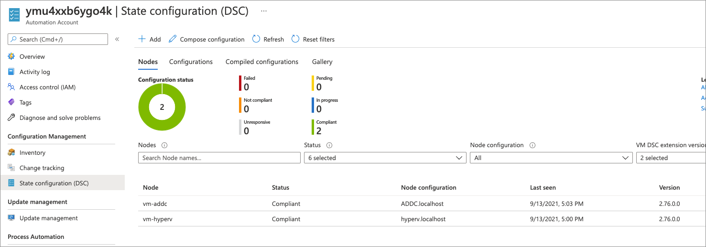

Azure Bicep template + DSC Configurations to do the following:

- Deploy Azure Automation State Configuration
- Deploy an Azure Automation credential object
- Import all needed PowerShell DSC modules
- Deploy a VM which is configured as an ADDC .via state configuration
- Deploy a VM which is configured as a Hyper-V host .via state configuration
- Deploy a log analytic instance and configure some logging

## Deploy

Click this button to deploy the solution:

Once completed, note that the two virtual machines have been onboarded into Azure Automation State Configuration and that they are both compliant.

## Other things

The deploy to Azure button works for native ARM templates, however not Azure Bicep templates. A GitHub Action builds an ARM template from the Bicep template each time a commit occurs to work around this limitation. 

The GitHub Action can be seen here - [link](./.github/bicep-build.yml).